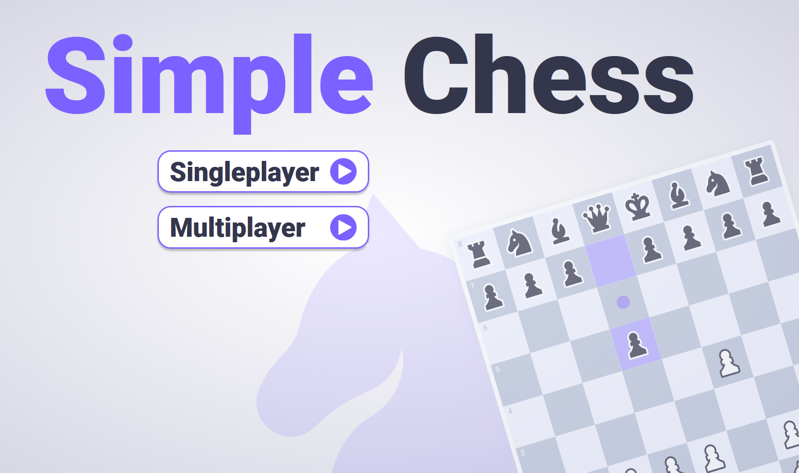

# Simple Chess: A Streamlined Digital Chess Experience

Welcome to Simple Chess! This is your one-stop destination for a user-friendly, digital chess experience. With a sleek React UI and a powerful Maven-backend, dive into chess games against AI or friends, all in a clean and straightforward setup.

## 📸 Screenshots




## 🌐 Quick Demo
Try it now: [Simple Chess Demo](https://chess-project-phi.vercel.app/)

## 🌟 Highlights

- **Sleek React UI**: Engage with an intuitive and responsive interface.
- **Efficient Maven Backend**: Experience seamless gameplay powered by Java and Maven.
- **Versatile AI Challenge**: Sharpen your skills against a smart computer opponent.
- **Friend Mode**: Enjoy games with friends on the same device.
- **Save Progress**: Easily pause and resume games.
- **Chess Clock**: Add excitement with a timed match.
- **Undo Moves**: Rethink strategies with the undo option.

## 🚀 Quick Start

### Setting Up the Backend

```bash
cd chess_backend
./mvnw spring-boot:run
```

### Launching the UI

Make sure you have Node.js and npm. Then:

```bash
cd chess_ui
yarn install
yarn start dev
```

Access the game at `localhost:3000`.

## 🔍 How to Play

1. Open `http://localhost:3000` in your browser.
2. Choose between AI and multiplayer modes.
3. Enjoy a game of chess with a clean and simple interface!
4. Achieve victory by checkmating your opponent.


## Authors

- [@ismail424](https://github.com/ismail424)
- [@McQueenMG](https://github.com/McQueenMG)
- [@oKenzz](https://github.com/oKenzz)
- [@IsmailR16](https://github.com/IsmailR16)
- [@p0ntu2](https://github.com/p0ntu2)


## 📜 License

Simple Chess is MIT licensed. See the [LICENSE](LICENSE) for details.

